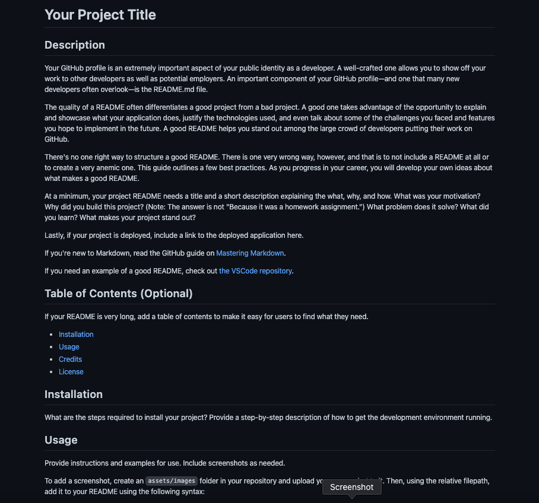

# ReadMe Generator
  
  
    
  ## Description

  This is a command line application that prompts for information and accepts user input in order to expedite the creation of a ReadMe file. The ReadMe file generated at the end of the questionnaire will look and read like a professional ReadMe file.

  ## Table of Contents

  * [Installation](#installation)
  * [Usage](#usage)
  * [Credits](#credits)
  * [License](#license)

  ## Installation

  You will need to make sure to have NODE installed. After that, clone the repo and type "npm install" in the terminal. 

  ## Usage

  Here is a screenshot showing what the command line application looks like when creating a readme

  

  ## Contributors

  Nathan Nelson - See contact info below 
  project starter code came from ASU coding bootcamp link to repo - https://github.com/coding-boot-camp/potential-enigma

  ## License

  

  [License](https://opensource.org/licenses/MIT) - Link to License

  
MIT License
Copyright (c) [2022] [Nathan Nelson]
Permission is hereby granted, free of charge, to any person obtaining a copy
of this software and associated documentation files (the "Software"), to deal
in the Software without restriction, including without limitation the rights
to use, copy, modify, merge, publish, distribute, sublicense, and/or sell
copies of the Software, and to permit persons to whom the Software is
furnished to do so, subject to the following conditions:
The above copyright notice and this permission notice shall be included in all
copies or substantial portions of the Software.
THE SOFTWARE IS PROVIDED "AS IS", WITHOUT WARRANTY OF ANY KIND, EXPRESS OR
IMPLIED, INCLUDING BUT NOT LIMITED TO THE WARRANTIES OF MERCHANTABILITY,
FITNESS FOR A PARTICULAR PURPOSE AND NONINFRINGEMENT. IN NO EVENT SHALL THE
AUTHORS OR COPYRIGHT HOLDERS BE LIABLE FOR ANY CLAIM, DAMAGES OR OTHER
LIABILITY, WHETHER IN AN ACTION OF CONTRACT, TORT OR OTHERWISE, ARISING FROM,
OUT OF OR IN CONNECTION WITH THE SOFTWARE OR THE USE OR OTHER DEALINGS IN THE
SOFTWARE.

  ## Tests

  run "node index.js" in the terminal to start

  ## Questions
  ### Contact Information
* [Email](mailto:nathan.nelson042@gmail.com) - Email Nathan Nelson : nathan.nelson042@gmail.com
* [GitHub](https://github.com/Hanstyl) - GitHub username : Hanstyl
