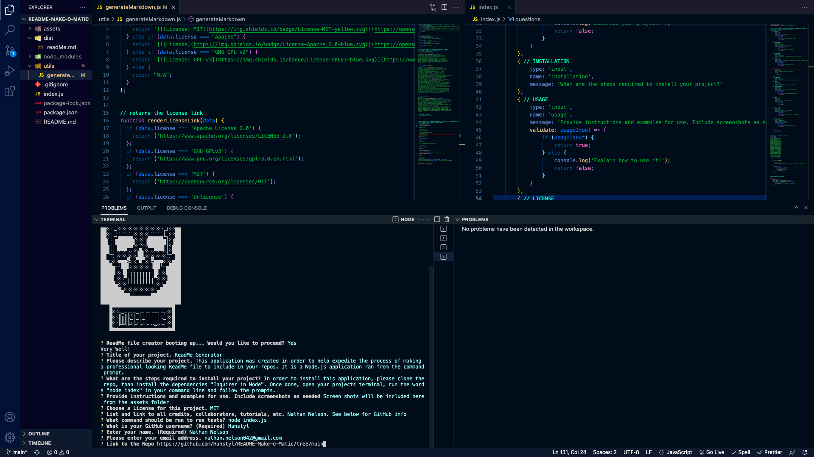

# Professional ReadME Generator
    N/A

  ## Description

  Your GitHub profile is an extremely important aspect of your public identity as a developer. A well-crafted one allows you to show off your work to other developers as well as potential employers. An important component of your GitHub profile—and one that many new developers often overlook—is the README.md file.

  ## Table of Contents

  * [Installation](#installation)
  * [Usage](#usage)
  * [Credits](#credits)
  * [License](#license)

  ## Installation

  In order to install this application, please clone the repo, than install the dependencies "Inquirer in Node". Once done, open your projects terminal, run the words "node index" in your command line and follow the prompts.

  ## Usage

  A screenshot is provided in the assets folder

  

  ## Contributors

  Nathan Nelson

  ## License

  

  [License](https://opensource.org/licenses/MIT) - Link to License

  
MIT License
Copyright (c) [2022] [Nathan Nelson]
Permission is hereby granted, free of charge, to any person obtaining a copy
of this software and associated documentation files (the "Software"), to deal
in the Software without restriction, including without limitation the rights
to use, copy, modify, merge, publish, distribute, sublicense, and/or sell
copies of the Software, and to permit persons to whom the Software is
furnished to do so, subject to the following conditions:
The above copyright notice and this permission notice shall be included in all
copies or substantial portions of the Software.
THE SOFTWARE IS PROVIDED "AS IS", WITHOUT WARRANTY OF ANY KIND, EXPRESS OR
IMPLIED, INCLUDING BUT NOT LIMITED TO THE WARRANTIES OF MERCHANTABILITY,
FITNESS FOR A PARTICULAR PURPOSE AND NONINFRINGEMENT. IN NO EVENT SHALL THE
AUTHORS OR COPYRIGHT HOLDERS BE LIABLE FOR ANY CLAIM, DAMAGES OR OTHER
LIABILITY, WHETHER IN AN ACTION OF CONTRACT, TORT OR OTHERWISE, ARISING FROM,
OUT OF OR IN CONNECTION WITH THE SOFTWARE OR THE USE OR OTHER DEALINGS IN THE
SOFTWARE.

  ## Tests

  node index.js

  ### Contact
* [Email](mailto:nathan.nelson042@gmail.com) - Email Nathan Nelson : nathan.nelson042@gmail.com
* [GitHub](https://github.com/Hanstyl) - GitHub username : Hanstyl
